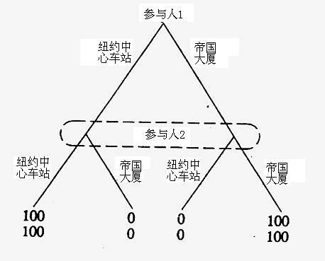

# Game Theory

## perfect information Dyn Game

### Concepts

Game Tree: node, branch, info set

### Promise & Nash Eq.

$I=\{low, high\}, II=\{buy, not\}$

game:

I \ II | not | buy
--------- | --------- | ------
low | (1, 0) | (2,-0.5)
high | (0,0) | (1.5,2)

ext game (strategy form):

I \ II | not | buy | not-buy | buy-not
--------- | --------- | ------ | ------ | -----
low | (1, 0) | (2,-0.5) |(1,0) | (2,-0.5)
high | (0,0) | (1.5,2) | (0,0) | (1.5,2)

### Rubinstein(1982)

## info ecomoics

### asymmetric information

| I \ II  | hidden actions | hidden information |
| ------- | -------------- | ------------------ |
| ex ante |                |                    |
| ex post |                |                    |

### agent-principal  problem

* $A$: 代理人行为
* $\theta$: 不受代理人控制的随机变量
* $x(a,\theta)$: 可观测结果
* $\pi(a,\theta)$: 货币收入，$a$-严格递增凹，$\theta$-递增
* $s(x)$: 激励合同
* $v(\pi-s(x))$: 委托人的期望效用
* $u(s(x))-c(a)$: 代理人的期望效用 ，$c(a)$代理人努力成本

其中$v'>0,v''\leq 0,u'>0,u''\leq 0, c',c''>0$.

冲突：委托人期望代理人多努力$\frac{\partial \pi}{\partial a}>0$，代理人期望少努力$c'>0$.

期望效用函数(P) $P(a)=E(v(\pi(a,\theta)-s(x(a,\theta))))$

参与约束/个人理性约束(IR) $R(a)=Eu(s(x(a,\theta)))-c(a)\geq \bar{u}$

激励相容约束(IC) $R(a)\geq R(a'),\forall a'\in A$.

委托人问题1

$$\max_{a,s(x)}P(a), s.t. IR, IC$$

委托人问题2

$$\max_{a,s(x)}\int v(\pi)-s(x)d F(x,\pi,a), s.t. IR, IC$$

## 聚焦均衡

Schelling(1960): 利用某些被博弈模型抽象掉的信息，使局中人都聚焦于某个 Nash 均衡，这个聚焦均衡就会成为预测的结果.

## 全信息动态博弈

#### 定义

1. 参与者集合$\Gamma$
2. 参与者行动顺序
3. 可选行动集合
4. 行动前了解到的信息
5. 每种局势（行动组合）的收益
6. 外生事件概率分布

#### 博弈树

* 节点：决策点、终节点
* 枝

#### 信息集

信息集：某参与者行动节点的集合

1. 信息集节点由相应参与者行动
2. 行动者不知道到达那个信息集中哪个节点

用虚线连接信息集、没有虚线是完美信息博弈

## 动力学

对称化

$z: Nash(C,C^T) \iff (x,y):Nash(A,B)$, $C_{ij,kl}=\frac{A_{il}+B_{kj}}{2}$, $x,y$: $z$-边际分布

对称博弈

复制方程
$$
x_i'=x_i((Ax)_i-x^TAx)\\
i.e.(\ln x_i)'=((Ax)_i-x^TAx)
$$
模仿动力学
$$
P(S_t=e_j)=x_j(t)\\
P(S_{t+\Delta t}=e_i|S_t=e_j)=x_if_{ij}\Delta t
$$
例1 $f_{ij}=((Ax)_i-(Ax)_j)_+$

例2 $f_{ij}=(1-s)B+s(Ax)_i$或$(1-s)B-s(Ax)_j$ 吸引度；

