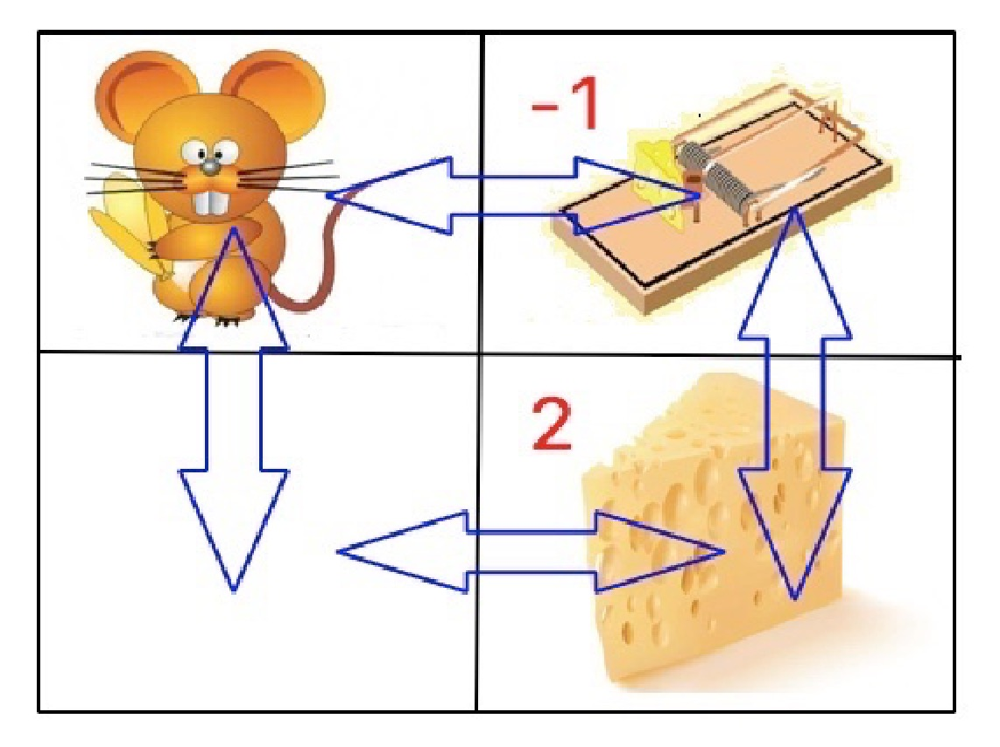

# 强化学习

[TOC]

关键字:

- 模型

  - 迁移
  
  - 奖励
  
  - 策略
- 值函数
  - 状态值函数
  - 状态-动作值函数

- Bellman 方程


- TD 算法
  
  - Sara算法
  
  - Q学习
  - 同/异策略
  
  
  

## [动态规划](https://en.wikipedia.org/wiki/Dynamic_programming)

强化学习是基于动态规划的。

### 模型

- 函数模型

  $(S, A,f, \pi, r, \gamma)$ 

  - $S$：状态集合
  - $A$:  动作集合
  - $f:S\times A\to S$状态转移函数
  - $\pi$: 策略
  - $r:S\times A\to\R$动作奖励
  - $\gamma$: 折扣因子

  当$f,\pi,r$为转移概率时，是非确定模型

- 图论模型（没有动作集）

  $(G=(V,E),f:V\to V, r:E\to\mathbb{R})$
  
  - $V$: 顶点集合，表示状态
  - $E$: 边集合，表示动作；一对状态$(s,s')$表征一个动作，从$s$迁移到$s'$
  - 策略是边组成的路径

#### 迁移

$$
f(a,s)=s':S\times A\to S
$$

#### 策略

策略: 动作序列 $p=a_1a_2\cdots a_n:W(A)$ 或者函数
$$
\pi(s)=a:S\to A,\\
v(s,a_1a_2\cdots)=r(s,a_1)+r(s_1,a_2)+\cdots, s_1=f(a,s),\cdots
$$
*最优策略* $v(s):=\max_pv(s,p)$

状态值函数递归公式 $v$
$$
v(s)=\max_a\{r(s,a)+\gamma v(s')\}, s\overset{a}{\to} s'\\
\pi(s):=\arg\max_a\{r(s,a)+\gamma v(s')\}
$$
或者(策略递归公式)
$$
p(s)=\arg\max_a\{r(s,a)+v(s')\}*p(s')
$$
其中$*$代表动作序列的衔接。

**Bellman 原理**

若 $v(s,pq)=\max_u v(s,u)$, 则 $v(s,p)=\max_u v(s,u,s'),v(s,q)=\max_u v(s',u)$


#### 值函数

- 状态-行为值函数
  $$
  q(s,a):= r(s,a) + \gamma v(s)
  $$

- 状态值函数
  $$
  v(s):=\max_a q(s,a)
  $$
  

### Bellman 方程

设状态迁移$s\overset{a/r}\to s'\overset{a'}{\to}s''$:
$$
\begin{cases}
v(s)=r(s,a)+\gamma v(s)\\
q(s,a)=r(s,a)+\gamma q(s',a')
\end{cases}
$$

Bellman 方程：$v,q$是(7)的不动点。

*图论模型*中
$$
\begin{cases}
v(s)=r(s,s')+\gamma v(s)\\
q(s,s')=r(s,s')+\gamma q(s',s'')
\end{cases}
$$


### 算法

```
function v(s)
    v=-M
    for a in actions(s)
        s' <- f(s, a)
        w q <- v(s')  # recursion
        r <- reword(s,a)
        v0 = w + r
        if v0>v
            v = v0
            p=aq
    return v, p
```


## Markov 决策 --- 不确定动态规划

已知动作下，状态转移不确定，奖励不确定。

### 模型

$(P_{ss'}^a, \pi, R_t, S, A)$, 折扣因子: $\gamma $ 

- 转移函数$f:S\times A\to P(S)$

  每个动作$a$对应一个$S\to S$转移概率$f(a)=P^a$，离散转态下正好是矩阵$P^a_{ss'}$.

- 奖励函数$r:S\times A\to P(\R)$

$f,r$: 转移概率

#### 迁移

$$
P_{ss'}^a=p(S_{t+1}=s'|A_t=a,S_t=s)
$$


#### 策略

$$
\pi(a|s)=p(A_t=a|S_t=s)
$$


#### 奖励

$$
G_t:=\sum_k\gamma^kR_{t+k+1}
$$


#### 状态值函数

$$
v_\pi(s):=E(G_t|S_t=s)=E(\sum_k\gamma^kR_{t+k+1}|S_t=s)\\
= \sum_{a\in A}\pi(a|s)(R^a_s+\gamma\sum_{s'}P_{ss'}^av_\pi(s'))
$$

 

#### 状态行为值函数

$$
q_\pi(s,a):=E(G_{t}|S_t=s,A_t=a)=E(\sum_k\gamma^kR_{t+k+1}|S_t=s,A_t=a)
$$


### Bellman 方程

$$
\begin{cases}
v(s)=E(R_{t+1}+\gamma v(S_{t+1})|S_t=s)\\
v(S_t)=E(R_{t+1}+\gamma v(S_{t+1})|S_t)\\
q_\pi(s,a)=E(R_{t+1}+\gamma q(S_{t+1},A_{t+1})|S_t=s,A_t=a)\\
q_\pi(S_{t},A_{t})=E(R_{t+1}+\gamma q(S_{t+1},A_{t+1})|S_t, A_t)
\end{cases}
$$


### 基模型

#### 策略迭代算法

算法迭代保证值函数递增：$\pi\mapsto \pi', q_{\pi}\leq q_{\pi'}$

1. 策略评估算法

$\pi\mapsto v$ (见*状态值函数*)

2. 策略提改善算法.

$v\mapsto \pi’$


## 强化学习

强化学习是一种模型未知的动态规划。



老鼠如果事先拿到地图，那么通过动态规划，就可以计算出那条路线是最好的，回报（奖励）最大的。但是如果事先没有地图，不知道地形，老鼠只能试探几次路线，记录每次回报，绘制出心理地图。

模型：

状态(位置)：{1,2,3,4}

动作：左、右、上、下

转移：略

回报：r(1,右)=-1，等

### 基于值函数 (模型未知)

MC: $v(s)\sim \frac{1}{N}\sum_i G_i(s)$

算法：

- 初始化: $S, A, Q,\pi, R$  ($\epsilon$-软 wrt $Q$)

- 迭代:
  - 采样: 用  $\pi$ 产生 $s,a$ 序列
  - 评估:$G_i(s)$, 则 $Q(s,a),v(s)$
  - 改善: $\pi'$

  

同/异-策略

**覆盖条件**：行动策略$\mu$覆盖目标策略 $ \pi$


思想: 如果模型未知，即$Q(s,a)=?,v(s)=?$, 那么利用MC采样估计。:thought_balloon:

### 时间差分TD

TD-公式
$$
V(S_t)=V(S_t)+\alpha\delta_t, \delta_t=R_{t+1}+\gamma V(S_{t+1})-V(S_t)\\
Q(S_t, A_t)=Q(S_t,A_t)+\alpha\delta_t, \delta_t=R_{t+1}+\gamma V(S_{t+1})-Q(S_t,a_t)
$$

#### Sarsa($\lambda$)

同策略

#### QLearning

异策略，Q表

算法

1. 初始化: $Q,s$

2. 循环:(更新 $Q$)

   - $a\in A(s_t)$

   - 迭代:
     -  $\epsilon$-贪婪策略选择 $a_t$
     - 计算$Q(s_t,a_t) :=... $
     - 迁移到 $s_{t+1}$

   - 直到 $s$ 是终状态

   直到 $Q$ 收敛

3. 输出最终策略 $\pi$


**例**

$\alpha=0.9,\gamma=0.9$

老鼠找迷宫Q表迭代

| 位置/动作 | 1/右 | 1/下 | 2/左 | 2/下 | ...  | 位置          |
| --------- | ---- | ---- | ---- | ---- | ---- | ------------- |
| 0         | 0    | 0    | 0    | 0    | ...  | 1             |
| 1右       | -0.9 | 0    | 0    | 0    | ...  | 2             |
| 2下       | -0.9 | 0    | 0    | 1.8  | ...  | 4(第一回终止) |
| ...       |      |      |      |      |      |               |


## 值函数逼近

#### Sarsa 算法

$\hat{q}:S\times A\times \R^n\to \R$

- 对每个周期

  - 初始化$s, a$

  - 循环

    - 选择 $a$, 得到 $r, s'$

    - 若 s' 是终状态: 

      $\theta = \theta+\alpha(r-\hat{q})\nabla \hat{q}$, 进入下一个周期

  - 选择 a' 估计 $\hat{q}(s',a',\theta)$

  - $\theta = \theta+\alpha(r+\gamma \hat{q}(s',a',\theta)-\hat{q}(s,a,\theta))\nabla \hat{q}$

  - $s=s', a=a'$


