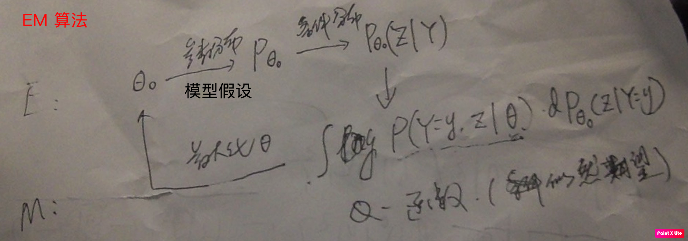

# Statistical Learning

[TOC]

## Linear Regression

### Linear Model

**Gauss-Markov model**

$Y=X\beta+\epsilon,\epsilon\sim CF(0,\sigma^2>0)$​​​​​​​


LSE: $\hat{\beta}=(X'X)^{-1}X'y$​​​​​​  (LE solution of $X\beta= y$​​)

**Guass-Markov thm**

$c'\beta$: ef  => LSE: $c'\hat\beta$ = BLUE ($a'y$) of $c'\beta$

$\hat{\sigma}^2=\frac{|\hat{\epsilon}|^2}{n-r}$: UE


$\epsilon\sim N(0,\sigma^2)$  Normal Linear model

$c'\hat{\beta}$: MVUE


**Generalized Gauss-Markov model**

$\epsilon\sim N(0,\sigma^2\Sigma),\Sigma>0$​​ 

$\beta^*=(X'\Sigma X)^-X'\Sigma^{-1}y$: GLSE/Aitken E


### Logistic Regression

$$
logit(P(1|X))=\alpha +\sum_j f_j(X_j)\\
\max L(f,\alpha) = \prod_ip(y_i|x_i, f,\alpha)
$$

$logit (y) =\alpha +\sum_j w_jx_j $ equiv. to single layer neural network，with cross-entropy as error function.

### Codes

```python
from sklearn.linear_model import LogisticRegression
lr = LogisticRegression(C=C, penalty='l1', tol=0.01, solver='saga')
lr.fit(X, y)
lr.score(X, y)
lr.predict(X)
```

### Quantile regression
$Q_\tau(Y|X)=f(X)=X\cdot \beta$

It is equiv to regression with loss function
$$
\rho(x)=|x|\begin{cases}
\tau, & x>0\\
(1-\tau),& x\leq 0
\end{cases}
$$

### Linear Discriminant Analysis LDA

$P(k|X=x)\sim f_k(x)p_k, (e.g. P(X=x|k)\sim f_k(x)\sim N(\mu_k,\Sigma_k))$​​

#### LDA

Assume $\Sigma_k=\Sigma$,

linear discriminant functions:
$$
\delta_k(x)=x^T\Sigma^{-1}\mu_k-\frac{1}{2}\|\mu_k\|^2_{\Sigma^{-1}}+\log p_k
$$

#### QDA

quadratic discriminant functions:
$$
\delta_k(x)=-\frac{1}{2}\|x-\mu_k\|^2_{\Sigma^{-1}}-\frac{1}{2}\log|\Sigma_k|+\log p_k
$$


conditional indep. $\Sigma_k=diag(\sigma_k^2)$​​​​, then
$$
\delta_k(x)=-\frac{1}{2}\|\sigma_k^{-1}\circ (x-\mu_k)\|^2-\tr\log \sigma_k+\log p_k
$$


#### RDA (Friedman 1989)

$\Sigma_k(\alpha)=\alpha\Sigma_k + (1-\alpha)\Sigma$, $\alpha$: shrinkage.


### Codes

```python
from sklearn.discriminant_analysis import LinearDiscriminantAnalysis
# input X, y
clf1 = LinearDiscriminantAnalysis(solver='lsqr', shrinkage='auto').fit(X, y)
clf2 = LinearDiscriminantAnalysis(solver='lsqr', shrinkage=None).fit(X, y)
score_clf1 = clf1.score(X, y)
score_clf2 = clf2.score(X, y)
# sklearn.discriminant_analysis.QuadraticDiscriminantAnalysis for QDA
```


## Max Entropy

$$
\max_{P\in \mathcal{P}} H(Y|X)\\
E_P(f)=E_{\tilde{P}}(f)
$$

$P_w(y|x)=\frac{1}{Z_w(x)}e^{\sum_iw_if_i(x,y)}$ solution of max $L(P, w)$ Laplace function of (2).
$$
\max_w \Psi(w), \Psi(w)=L(P_w,w).
$$

*Remark*. $\Psi(w)=L_{\tilde{P}(P_w)},L_{\tilde{P}(P)}=\ln \prod_{x,y}p(y|x)^{\tilde{p}(x,y)}$.


## AdaBoost Algorithm

A special additive model.

### AdaBoost

**Algorithm**

input training data $(x_j, y_j)$, output classifier $G(x):X\to \{-1,1\}$

1. weights of data $D_1=(w_{11},\cdots , w_{1j}, \cdots)$, $w_{ij}=\frac{1}{N}$

2. * get $G_m$ according $D_m$
   * $e_m=P(G_m(x_j)\neq y_j)=\sum_{G_{m}(x_j)\neq y_j} w_{mj}$
   * coef of $G_m(x)$,  $\alpha_m=\frac{1}{2}\ln \frac{1-e_m}{e_m}$
   * get $D_{m+1}$ where $w_{m+1,j}=\frac{w_{mj}}{Z_m}e^{\alpha_my_iG_m(x_i)}$

3. $G(x)=\mathrm{sign}(f(x))=\mathrm{sign}(\sum_m \alpha_mG_m(x))$

$D_1\to G_1\to (e_1\to \alpha_1)\to D_2\to G_2\to\cdots G$.


for 2-classes problem:

$Z_m=2\sqrt{e_m(1-e_m)}=\sum_jw_{mj}e^{\pm\alpha_m}$

#### Bound of Error

$$
E=\frac{1}{N}\sharp\{G(x_j)\neq y_j\}\leq\frac{1}{N}\sum_i e^{-y_if(x_i)}=\prod_mZ_m.
$$

$$
E=\prod_m2\sqrt{e_m(1-e_m)}\leq e^{-2\sum_m(1/2-e_m)^2} (2-classes)
$$

*Remark*. It is a sort of **forword stagewise algorithm**, with $L(y, f)=e^{-yf}$.

*See also* Boosting tree, with $L(y,f)=(y-f)^2$.


```python
clf = AdaBoostClassifier(base_estimator=DecisionTreeClassifier, n_estimators=50, random_state=11)
```


## EM algorithm

Model $P(Y,Z|\theta)$, where $Z$ is hidden (labels of samples).

MLE1 est. $\theta$
$$
\max L(\theta)=\log P(Y|\theta)=\sum_i\log\int p(y_i|z,\theta)p(z|\theta)dz
$$
MLE2

$$
\max L(\theta)=El_y(Z,\theta) \\
$$
*log-likelihood expection*: $El_y(Z,\theta)=\sum_i\int_z\log p(y_i,z|\theta)p(z|y_i,\theta)=\sum_i\frac{1}{p(y_i|\theta)}\int_z\log p(y_i,z|\theta)p(y_i,z|\theta)$

In discrete form, $\sum_{z,i}\log p(y_i,z|\theta)p(z|y_i,\theta)$

### Algorithm (Baum-Welch)

Model with latent/hidden rv$(Y,Z,\theta)$, where $Z$ is hidden.

**Algorithm**

input $Y,Z$-distribution $P(Y,Z|\theta)$ and observants of $Y=y$, output $\theta$

1. set $\theta_0$

2. - E: post dist(responsibility): $F(z|y,\theta_i)$

     "hidden likelihood": $Q(\theta,\theta_i)=E_Z(\log P(Y=y,Z|\theta)|Y=y, \theta_i)=\int_z \log P(y,z|\theta) \mathrm{d}F(z|y,\theta_i)$, $Q$-function

   - M:

   $\theta_{i+1}=\arg\max_{\theta} Q(\theta,\theta_i)$

3. repeat 2 until convergence


**Theorem** in EM

$P(Y|\theta_i)\nearrow$, $L(\theta_i)\to L^*$ if $P(Y|\theta)$ is ub; $\theta_i\to \theta^*$ stable point of $L$, in most cases.

*proof*. 
$$
\log P(Y|\theta_{i+1})-\log P(Y|\theta_i)=Q(\theta_{i+1}, \theta_i)-Q(\theta_i, \theta_i)+d \quad(B-W eq.)
$$
 where $d$ is the [Kullback–Leibler divergence](https://en.wikipedia.org/wiki/Kullback%E2%80%93Leibler_divergence) of $Y,Z|\theta_{i+1}$ and  $Y,Z|\theta_i$.


*Remark*. EM sloves $\max L(\theta)$.
$$
L(\theta)-L(\theta_0)\geq B(\theta,\theta_0)-L(\theta_0)=\Delta\\
\arg\max_\theta B(\theta,\theta_0) \sim \arg\max_\theta Q(\theta,\theta_0)
$$

#### Examples

* 3-coins model: $Z\sim B(\pi)$,$Y_1\sim B(p), Y_2\sim B(q)$,

    observation: $P(z|y_j,\theta)=\mu_j$

    - E: 
      $P(z|y_j,\theta)=\mu_j$
    - M:
      $\pi' = \frac{1}{n}\sum_j\mu_j, p'=\frac{\sum_j\mu_jy_j}{\sum_j\mu_j},q'=...$

* Gaussian mixture model，$Y\sim N(\mu,\sigma^2)$


#### Codes

```python
# Classification with Gaussian Mixture
gm = sklearn.mixture.GaussianMixture(n_components=2, covariance_type='full')

X = np.array([-0.39,0.12,0.94,1.67,1.76,2.44,3.72,4.28,4.92,5.53,0.06,0.48,1.01,1.68,1.8,3.25,4.12,4.6,5.28,6.22])
X = X.reshape(-1,1) # shape (n_samples, n_features)
gm.fit(X)
print(gm.predict(X))

print(gm.predict_proba(X))  # cond prob of X | theta
```




#### Comparison

| EM                        | NB            |
| ------------------------- | ------------- |
| $P(Y,Z|\theta)$           | $P(Y,Z)$      |
| ml / pt. est. $\theta$    | exp. dist.    |
| $P(Z|Y,\theta)$           | $P(Z|Y)$      |
| assume $P(Y,Z| \theta_0)$ |               |
| sample $Y$                | sample $Y,Z $ |


#### Special case

1. stratified

$P(Y,Z|\theta)=P(Y|Z,\theta_1)P(Z|\theta_2)$

$Y|Z,\theta_1\sim f(y|z,\theta_1),Z\sim g(z|\theta_2)$

*log-likelihood expection*: $El_y(Z,\theta)=\sum_i\int_z(\log p(y_i|z,\theta_1)+\log p(z|\theta_2))p(y_i|z,\theta_1)p(z|\theta_2)/p(y_i|\theta_1)$

2. mixture model

$Y|k,\theta_k\sim f(y|k,\theta_k),k\sim p_k$

### GEM

**Definition(F function)**

$F(p,\theta)=E_Z(\ln P(Y, Z|\theta))+H(p)$.


### MCMC, Gibbs Sampling

$x_j(t)\sim f(X_j|x_{\hat{j}}(t-1))$ full cond dist.

see **Hammersley-Clifford Thm**

consider the latent rv $Z$ in EM to be another parameter.

#### Algorithm

1. set $\theta^{(0)}$

2. repeat for $t$

   - generate $\Delta_i^{(t)}\sim B(\hat{\gamma}_i(\theta^{(t)}))$

   - $\hat{\mu}_1=\frac{\sum_{\Delta_i^{(t)}=0}y_i}{\sharp\{\Delta_i^{(t)}=0\}},\hat{\mu}_2=...$

     generate $\mu_1^{(t)}\sim N(\hat{\mu}_1)$​


## HMM

A time series version of EM model

 $\theta=(A,B,\pi)$: *ransition probability emission probability, start probability* 

### Assumption

- $z_t$: states/hidden
- $y_t$: observations

| $Y$  | $Z$    | $\theta$ |
| ---- | ------ | -------- |
| obs. | states | param.   |

<center>the form of the data</center>
#### Markov Assumption

1. transition prob. $P(z_t|z_{t-1},y_{t-1},\cdots)=P(z_t|z_{t-1})\sim A$

2. emisstion prob. $P(y_t|\cdots) = P(y_t|z_t)\sim B$

3. start dist. $P(z_1)\sim\pi$

   

*remark* state monoid: $z_{t-1} \to (z_t, y_t)$


#### prediction prob.

$\gamma_t(i)=P(Z_t=i|y, \theta),\xi_t(i,j)=P(Z_t=i,Z_{t+1}=j,y|\theta)$


### Problems

1. $P(Z|\theta)=?$

2. $P(Y|Z,\theta)\sim P(Y,Z|\theta)=?$

3. $\arg\max_\theta P(X|\theta)$

   

Task:

generate $Z$ from $y_1$


### Algorithm

**Definition (forward prob)**

$\alpha_t(z):=P(Y_1,\cdots,Y_t,Z_t=z|\theta)$

**Algorithm**

input $\theta, y$

output $P(Y|\theta)$

1. $\alpha_1(i)=\pi_ip(y_1|z_i)$

2. $\alpha_{t+1}(i)=(\sum_j\alpha_t(j)a_{ji})P(y_{t+1}|z_i)$

3. $P(Y|\theta)=\sum_i\alpha_T(i)$

   

**Definition(backward prob)**

$\beta_t(x) := P(Y_{t+1},\cdots,Y_T|Z_t=z,\theta)$

**Algorithm**

input $\theta, y$

output $P(Y|\theta)$

1. $\beta_T(i)=1$
2. $\beta_{t-1}(i)=\sum_j\beta_{t}(j)a_{ij}p(y_{t}|z_j)$
3. $P(Y|\theta)=\sum_i\pi_ip(y_1|x_i)\beta_1(i)$.


**Formula**

$$
\gamma_t(i)\sim \alpha_t(i)\beta_t(i)\\
\xi_t(i, j)\sim \alpha_t(i)\beta_{t+1}(j)a_{ij}p(y_{t+1}|z_j,\theta)
$$


### Learning Algorithm

$$
\max Q(\theta,\theta')=-H(P,P')
$$

 cross-entroy of $X, Y$.

**Baum-Welch Algorithm**

input: $y$, output: $\theta$

1. initialize $\theta_0 = (A_0,B_0,\pi_0)$

2. loop:

   - E-step: calculate $\gamma, \xi$ under $\theta$

   - M-step: update $\theta$

     $a_{ij} \sim \sum_t\xi_t(i,j),b_{jk} \sim \sum_{Y_t=y_k}\gamma_t(j),\pi:=\gamma_1$

3. until convergent


### Predict Algorithm

$\delta_t(i):=\max_{x_1,\cdots,x_{t-1}}P(x_t=i,x_{t-1},\cdots,x_1,y|\lambda)$, esp. $\delta_1(i)=P(x_t=i,y|\lambda)$

$\delta_{t+1}(i)=\max_j(\delta_t(j)a_{ji})p(y_{t+1}|x_i)$

**Viterbi Algorithm**

input: $\theta,y$

calc $\delta_t(i)$ and record $x_t$

output: $x^*$


### Gaussian HMM

$Y_t|z\sim N(\mu_{z},\Sigma_{z})$


### Codes

```python
>>> remodel = hmm.GaussianHMM(n_components=3, covariance_type="full", n_iter=100)
>>> remodel.fit(X)  # X: n_samples * n_features
GaussianHMM(algorithm='viterbi',...
>>> Z2 = remodel.predict(X)
            
>>> from hmmlearn.hmm import MultinomialHMM
>>> MultinomialHMM(n_components=2)                            
# MultinomialHMM(algorithm='viterbi',...
```


## CRF


### PGM

pairwise/local/global Markov property.


## Additive Models

$Y=\hat{\alpha}+\sum_jf_j(X_j)+\epsilon, \epsilon\sim N(0,\sigma^2)$

### Backfitting Algorithm

1. $\hat{\alpha}=\frac{\sum y_i}{N}, hat{f}_j=0$

2. Cycle $j=1...p...1...$
   $$
   \hat{f}_j := S(\{(x_{ij}, y_i-\hat{\alpha}-\sum_{k\neq j}\hat{f}_k(x_{ik}))\})\\
   \hat{f}_j =\hat{f}_j- ave(\hat{f}_j(x_{ij}))
   $$


## Tree

### Entropy

$H(X)=-\int p(x)\log p(x)=-E\log p(X)$​​​​​

sample entropy

$H(X)=-\frac{1}{N}\sum_i\log p(X_i)\sim -\sum_k f(X_k) \log f(X_k), f(x_k)=\frac{N(X_k)}{N}$​​​


conditional entropy

$H(X|y)=-\int p(x|y)\log p(x|y)$​​

$H(X|Y)=\int H(X|y)p(y)=E(H(X|y)\circ Y)$​​


$H(X|Y)=H(X,Y)-H(Y)$

cross entropy $C(X,Y)=-\int p(x)\log q(x)=-E\log q(X)$

mutual information

$I(X;Y):=H(X)-H(X|Y)$​

KL divergence: $D(X\| Y)=C(X,Y)-H(X)$
$$
I(X;Y)=H(X)+H(Y)-H(X,Y)=\int p(x,y) \log(p(x,y)/p(x)p(y))\\
=E\log p(x,y)/p(x)p(y)=E\log p(y|x)/p(y)\\
=D((X,Y)\|X\times Y)\geq 0
$$
$I=0\iff X\perp\!\!\!\perp Y$​​​


#### codes for sample entropy based on scipy

```python
def entropy(xs):
    fd = _FreqDist(xs)   # nltk.FreqDist
    ps = tuple(fd.values())
    return scipy.stats.entropy(ps, base=2)
  
from sklearn.metrics import mutual_info_score
# x, y: 1D array
mutual_info_score(x,y)  # np.log(2)
```


### ID3

$Gain(S, A) := H(S) - H(S|A)$​​​ information gain (mutual information $I(Y;X_A)$​​​)


**Algo.**

- given jion distr. $p(x,y)$

1. if feature set $A=\empty$ return $T$
2. else calc $g(Y, X_i)$ info gain of data wrt i-th feature, select the maximum say $X_g$
3. if $g$ is small, then return $T(c)$ where $p(y=c)=\max p(y)$
4. else cut $Y$ to $Y_k$ according to $X_i = k$, $T(...,T_k(c_k),...)$
5. repeat the process for $T_k(c_k)$ wrt $A\setminus \{X_g\}$, go to 1 


### ID4.5

$A: (x_i<t, x_i\ge t)$​


### CART

$Gini(S,A)$


### Codes

```python
>>> from sklearn import tree
>>> X = [[0, 0], [1, 1]]
>>> Y = [0, 1]
>>> clf = tree.DecisionTreeClassifier()
>>> clf = clf.fit(X, Y)
>>> clf.predict([[2., 2.]])
array([1])

#the probability of each class can be predicted, which is the fraction of training samples of the same class in a leaf

>>> clf.predict_proba([[2., 2.]])
array([[0., 1.]])
```


## Association Rules

$$
\max P(\bigcap_j X_j\in s_j), s_j\subset S_j
$$

### Market Basket Analysis

$$
\max P(\bigcap_j X_j\in s_j)=T(J)=P(\bigcap_{j\subset J} X_j=v_j), s_j= S_j or \{v_j\}
$$

dummy var tech. $Z_k=1 \iff X_j=v_l$
$$
\{K_l| T(K_l)>t\}
$$

### Apriori Algo.

#### Concepts

- association rules $A\Rightarrow B$
- support $T(A\Rightarrow B)$
- confidence $C(A\Rightarrow B)=\frac{T(A\Rightarrow B)}{T(A)}$
- lift $L(A\Rightarrow B)=\frac{C(A\Rightarrow B)}{T(A)}$


#### Algorithm

```
input T e
L1 = {|c|=1, count[c]>e}
k = 2
unless L_{k-1} is empty
    C_k = {c=a+b, (b not in) a in L_{k-1}, P_{k-1}c sub L_{k-1}} # prune candidates.
    for t in T
        Dt = {c in C_k, c sub t}
        for c in Dt
            count[c] ++
    Lk = {c in C_k count[c]>e}
    k ++
return union of L_k
```


#### Codes

##### Python

```python
from efficient_apriori import apriori
transactions = [('eggs', 'bacon', 'soup'),
                ('eggs', 'bacon', 'apple'),
                ('soup', 'bacon', 'banana')]
itemsets, rules = apriori(transactions, min_support=0.5,  min_confidence=1)
print(rules)  # [{eggs} -> {bacon}, {soup} -> {bacon}]
```

##### R
```R
library(arules)

data<-read.csv("voting-records.csv", header=F)
data_rules <- apriori(data = data, parameter = list(support = 0.3, confidence = 0.9, minlen = 2))


data(Groceries)  #调用数据文件

frequentsets=eclat(Groceries,parameter=list(support=0.1,maxlen=10))  #求频繁项集
inspect(frequentsets[1:10])    #查看求得的频繁项集
inspect(sort(frequentsets,by="support")[1:10])    #根据支持度对求得的频繁项集排序

rules=apriori(Groceries,parameter=list(support=0.1,confidence=03))    #求关联规则
summary(rules)    #察看求得的关联规则之摘要

x=subset(rules,subset=rhs%in%"whole milk"&lift>=1.2)    #求所需要的关联规则子集
inspect(sort(x,by="support"))    #根据支持度对求得的关联规则子集排序并察看 
```


## Dim Reduction

### NMF

$X\sim WH$, where $X,W: N\times r, H:r\times p$: non-negative

```python
>> import numpy as np
>>> X = np.array([[1, 1], [2, 1], [3, 1.2], [4, 1], [5, 0.8], [6, 1]])
>>> from sklearn.decomposition import NMF
>>> model = NMF(n_components=2, init='random', random_state=0)
>>> W = model.fit_transform(X)
>>> H = model.components_
# r: n_components
```


## RVM relevance vector machine

### Theory

1. Likelihood $t|x,w,\sigma^2\sim N(w\cdot\phi(x),\sigma^2)$

2. parameter-priori: $w|\alpha\sim N(0,\alpha^{-1} I)$

3. posteriori: $w|t,\alpha,\sigma^2\sim N(m,\Sigma)$ where
   $$
   m = \sigma^{-2}\Sigma \Phi^T t\\
   \Sigma = (A+\sigma^{-2}\Phi^T\Phi)^{-1}, A=diag(\alpha)
   $$
   
4. parameter-total: $t|\alpha,\sigma^2$
   $$
   \ln p(t|\alpha,\sigma^2)\sim -N/2\ln\sigma^2-Et-1/2\ln|\Sigma|+1/2\sum_i\ln\alpha_i
   $$

### EAP (evidence approximation procedure)

MLE: $\max \ln p(t|\alpha, \sigma^2)$

iteration: (eq of $\alpha,\sigma^2$)

1. $\gamma_i\leftarrow 1-\alpha_i\Sigma_{ii}$
2. $\alpha_i\leftarrow\gamma_i/m_i^2$
3. $\sigma^{-2}\leftarrow\frac{N-\sum_i\gamma_i}{\|t-\Phi m\|^2}$


more stable
$$
m = \Sigma' A^{-1}b\\
\Sigma' = (\sigma^2+A^{-1}G)^{-1}\\
\Sigma'' = \sigma^2\Sigma'\\
\Sigma = \Sigma''A^{-1}
$$


1. $\gamma_i=1-\Sigma''_{ii}\in [0,1]$

2. $\alpha_i^{-1}=0(\gamma_i=0),m_i^2/\gamma_i$

3. $\sigma^{2}=\frac{\|t-\Phi m\|^2}{N-\sum_i\gamma_i}$

   loop until $\sigma^2$ is small

return $\alpha_i^{-1},\sigma^2$


### Prediction

  estimate:

$t|x',\alpha,\sigma^2\sim N(m\cdot \phi(x'), \sigma^2(x'))$

confidence:

   $\sigma^2(x')= \sigma^2+\|\phi(x')\|_\Sigma^2$


### Auto Relevance Determination

If $\alpha_i\to \infty$, then $\Sigma(i,:)\to 0,  m_i \to 0$, $\alpha_i\Sigma_{ii}\to 1$

$w_i \overset{p}{\to} N(0,0)$. otherwise $x_i$ is called *relevance vec*.


## Appendix

### Lemma(Hunter-Lange)

If g is minorize $f$, ($g(x,x)=f(x), g(x, y)\leq f(x)$), then

$u_{n+1}:=\arg\max_u g(u, u_n)$, and $g(u_n)\searrow$. 

*Remark.* $\leq$ only needs transport property


### scikit-learn

#### Sampling

```python
# samples
X, y=make_classification(n_samples=1000, n_feartures=50, n_informative=10, n_clusters_per_class=3, random_state=11)

lb = LabelBinarizer()
ss = StandardScaler()
```

#### Base classes

```python
class TextStats(BaseEstimator, TransformerMixin):
    """Extract features from each document for DictVectorizer"""
    def fit(self, x, y=None):
        return self
    def transform(self, posts):
        return [{'length': len(text),
    'num_sentences': text.count('.')} for text in posts]

```

