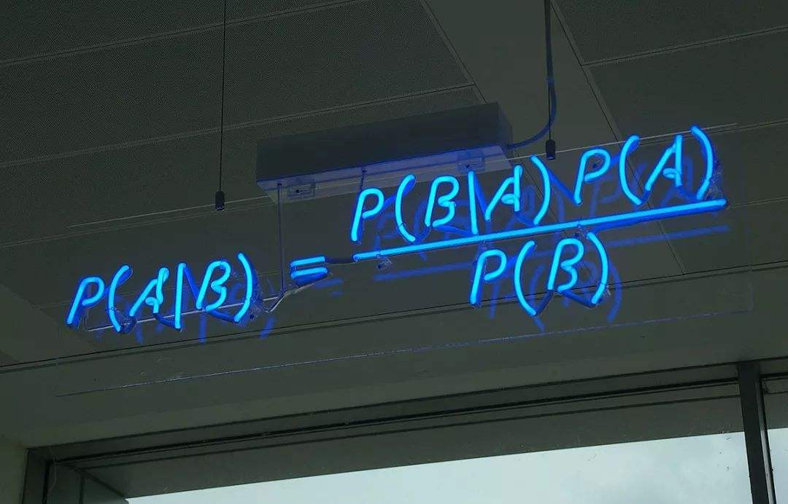
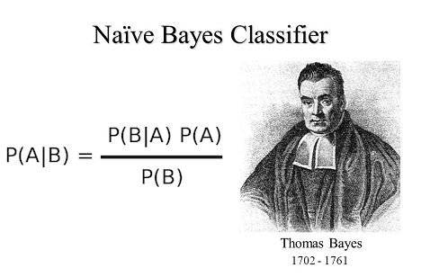
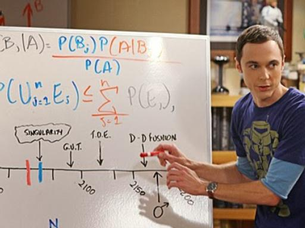

# Bayes 分类器

[TOC]


大道至简。:yin_yang: 简单的等式，简单的假设；这个世界上最质朴的机器学习。:crystal_ball:

简洁的公式照射出理性的光辉。:candle:

**关键词：**Bayes公式，Bayes分类，先验-后验概率，条件独立性，特征-标签，分布



## 原理:triangular_ruler:

### Bayes 公式

$p$是随机变量$X, Y$的密度函数
$$
p(y|x)=\frac{p(x|y)p(y)}{p(x)},\\
p(y|x,\theta)=\frac{p(x|y,\theta)p(y,\theta)}{p(x,\theta)} ~~~~~~~~~~~~~~~~~(参数形式)
$$
*证明* 这是一个恒等式！！！:astonished:

#### 解释

$x$是随机变量，$y$是待估计参数(也是随机变量)

Bayes估计中的称谓：

- $p(x|y)$似然概率（条件概率）
- $p(y)$先验概率
- $p(y|x)$后验概率
- $p(x)=\int p(x|y)p(y)\mathrm{d} y$全概率
- $p(x,y)=p(x|y)p(y)$联合概率

### 喜闻乐见的例子

#### 教科书式的例子：发型-性别:books:

$x$:发型，$y$:性别

调查发现男生98%短发，2%长发，女生95%长发，5%短发。某院校男女比例3：1。问长（短）发的男女比例？

调查发现男生发长服从$N(5,0.1^2)$，女生服从$N(40,5^2)$。某院校男女比例3：1。问发长$x$的男女比例？

#### 八卦必备：星座-爱情:leo:

$x_1$:男方星座，$x_2$:女方星座，$y$:是否般配

星座分布与性别无关$p(x_1)=p(x_2)$,且相对于$y$条件独立。估计任意一种星座组合般配可能性。

#### 致命病毒——贝叶死( Bayes death)

$x$: 检测是否感染，$y$:是否真的感染

某地区爆发"贝叶死”病毒疫情，估计有总人口的1/10000被感染。如果你被检测精度为99%的仪器判断为被感染，问你真的被感染的概率是多少？

## 朴素Bayes分类:balance_scale:



模型名称：

**朴素Bayes分类器**

术语：

- 模型输入/**属性attribute（特征feature）**$x=(x_1,x_2,\cdots,x_n)$

- 模型输出/**类别class（标签label）**$c$

假设：

- 条件独立假设：$p(x|c)=\prod_ip(x_i|c)$

- 概率模型：$p(x_i|c)=f_{c,i}(x_i)$ (一般采用同分布形式$p(x_i|c)=f_{c}(x_i)$)

*思考：为什么引入条件独立假设？它的好处是什么，代价是什么？*:thinking:


*注：严格的写法是$P(X_i=x_i|c)=p_i(x_i|c)$, 作为函数$p_i(\cdot|c)$是不一定相同的。:paw_prints:*


训练数据（样本）：

| $x_1$:血型:syringe: | $x_2$:星座:libra: | $c$渣不渣:label: |
| ---------- | ---------- | --------- |
| O          | 射手       | 是        |
| AB         | 双子       | 不        |
|A|金牛|不|
|B|天秤|不|

测试数据：
| $x_1$:血型 | $x_2$:星座 | $c$渣不渣 |
| ---------- | ---------- | --------- |
| AB          | 射手       | 是        |
| A          | 天秤       | 不        |

*注：没有条件独立假设，某些测试数据因为没有在训练数据中出现过，其概率可能被误判为0，无法做出判断。有了这个假设，只要测试样本每个属性都在训练样本中出现过就不会出现这类误判，分类器才有泛化能力。这样做也有代价，因为属性很可能具有相关性，误差是不可避免的。*

### 基本公式

类别预测$\hat{c}(x)=\arg\max_cp(c|x)$。 (**MAP估计**)
$$
p(c|x)\sim \prod_ip(x_i|c)p(c)= \prod_ip(x_i,c)p(c)^{1-n}\\
\sim \prod_ip(c|x_i)p(c)^{1-n},\\
\ln p(c|x)\sim \sum_i\ln p(x_i,c)+(1-n)\ln p(c)\\
$$

*这里省略常数项$p(x)$*:paw_prints:

*条件独立假设，把多元（高维）函数的拟合$p(c|x)$，分解成一元（低维）函数的拟合$p(c|x_i)$。朴素Bayes是一种可加模型$f(x)=\sum_if_i(x_i)$。*

### 估计


$$
\hat{p}(c|x)\sim\prod_i\hat{p}(x_i,c)\hat{p}(c)^{1-n}\\
\sim\prod_i\hat{p}(c|x_i)\hat{p}(c)^{1-n}
$$

*这里省略常数项。*🐾


### 0-1 情形

$$
r = \ln\frac{p(1|x)}{1-p(1|x)}\sim \sum_i\ln\frac{\hat{p}_1(x_i)}{1-\hat{p}_1(x_i)}+(1-n)\ln\frac{\hat{p}_1}{1-\hat{p}_1} \\
$$

当 $r\geq 0$, $x$是 1 类, 否则 0 类.


### 流程:play_or_pause_button:

数据分析流程

1. 确定属性$x$，确定类别$c$，收集数据

2. 估计$\hat{p}(c),\hat{p}(x_i|c)$或者$\hat{p}(x_i,c)$

   对离散随机变量常用频数估计，如$\hat{p}(x_i,c)=\frac{N (x_i,c)}{N}$，对于连续随机变量或者值域过大的数字型离散随机变量推荐用核估计（如近邻估计），更好的是提供参数分布。*非数字型随机变量只能用频数估计* :construction:

3. 计算$\hat{p}(c|x)$

4. 预测$\hat{c}(x)$


*注：对于分类问题，$c$是有限离散的，一般用频数估计$\hat{p}(c)$，否则推荐用核密度估计。*:paw_prints:


## 密度函数估计与选择🎲

*最关键的是密度函数的估计。因为现实中，通常并不知道真实的条件概率，必须从数据中估计出来。*:key:

### 非参数模型

- 先验概率的估计

$\hat{p}(c)=\frac{N(c)}{N}$。

- 联合密度、条件密度的估计

$\hat{p}(x,c)=\frac{N(x,c)}{N}, N(x,c):$  $c$类中$x$（附近）样本数，$N$样本总个数

$\hat{p}(x|c)= \frac{N(x,c)}{N(c)}, N(x,c):$  $c$类中$x$（附近）样本数, $N(c)$: $c$类样本个数

- 平滑： $\hat{p}(x|c)=\frac{N(x,c)+1}{N+S}$, $S$是$x$取值总数。 $\hat{p}(c)=\frac{N(c)+1}{N+K}$, $K$是类别数。

*连续值分布可采用核密度估计。*

### 参数模型

参数模型只需估计参数，但要合理选择参数分布。

设分布为$p(x|c,\theta)$, 则$\hat{p}(x|c)=p(x|c,\hat{\theta})$。

常用分布：
- Gaussian 分布: $p(x|c,\mu,\sigma^2)\sim N(\mu,\sigma^2)$
- 多项式分布: $p(x|c,p)\sim M(p)=M(p_1,p_2,\cdots)$
- Bernoulli 分布: $p(x|c,p)\sim B(p)$


*对于回归问题，$c$是连续的，$p(c)$可以采用核密度估计。或者假定为Gaussian分布。*

## 文本分类例子:sa:

*文本分类大概是是Bayes估计最出色的应用，文本分类的特点是要处理非数字型随机变量*

文档$d$：文字集合$\{w_i\}$构成的序列

- 多项式模型: （对于$x_i$不是条件独立的/朴素Bayes的:paw_prints:）

  第$i$个属性$x_i$是$w_i$出现次数。$(x_i=\sharp \{w\in d ,w=w_i\})\sim M(p)$ 

- 文字序列模型(=多项式模型):（对于$d_i$是朴素Bayes的）

  $x_i=d_i$，$d$的第$i$个文字

- Bernoulli 模型:

  第$i$个属性$x_i$是$w_i$是否出现。$x_i = w_i \in d\sim B(p_i)$ 

>  爱的供养 =
>     {把你放在手上 虔诚地焚香
>     剪下一段烛光 将经纶点亮
>     不求荡气回肠 只求爱一场
>     爱到最后受了伤 哭得好绝望
>     我用尽一生一世 来将你供养
>     只期盼你停住 流转的目光
>     请赐予我无限爱 与被爱的力量
>     让我能安心在菩提下 静静的观想
>     我用尽一生一世 来将你供养
>     人世间有太多的 烦恼要忘
>     苦海中飘荡着你 那旧时的模样
>     一回头发现 早已踏出了红尘万丈}

多项式模型:

- 特征：$x_1$:"把”字数, $x_2$:"你”字数,...

- 输入：文档《爱的供养》=(把=1,你=5,放=1,...一=7，…) = (1,5,1,…7,...)

- 输出：爱情类


文字序列模型(=多项式模型)

- 输入：文档《爱的供养》=(第一个字=把,第二个字=你,...) = (把，你，…)

- 输出：爱情类

Bernoulli 模型:

- 特征：$x_1$:"把”是否出现, $x_2$:"你”是否出现,...

- 输入：文档《爱的供养》=(把=1,你=1,放=1,...一=1，…,) = (1,5,1,…7,...)

- 输出：爱情类

> 我和我的祖国=
> {我和我的祖国
> 一刻也不能分割
> 无论我走到哪里
> 都流出一首赞歌
> 我歌唱每一座高山
> 我歌唱每一条河
> 袅袅炊烟 小小村落
> 路上一道辙
> 我最亲爱的祖国
> 我永远紧依着你的心窝
> 你用你那母亲的脉搏
> 和我诉说
> 我的祖国和我
> 像海和浪花一朵
> 浪是那海的赤子
> 海是那浪的依托
> 每当大海在微笑
> 我就是笑的旋涡
> 我分担着海的忧愁
> 分享海的欢乐
> 我最亲爱的祖国
> 你是大海永不干涸
> 永远给我碧浪清波
> 心中的歌}


多项式模型:

- 输入：文档《我和我的祖国》=(把=0,你=3,放=0,...一=6，…) = (1,3,0,…6,...)
- 输出：主旋律

文字序列模型(=多项式模型)

- 输入：文档《我和我的祖国》=(第一个字=我,第二个字=和,...) = (我，和，…)

- 输出：爱情类

Bernoulli 模型:

- 输入：文档《我和我的祖国》=(把=0,你=1,放=0,...一=1，…,) = (0,1,1,…1,...)

- 输出：主旋律


混合Bayes模型：用Bernoulli 模型进行训练，用多项式模型进行预测

*Bernoulli 模型相当于把多项式模型的文本中重复出现的文字压缩成一个字。*:paw_prints:


*思考1*🤔利用一些文本特有的规律(如Zipf定律)，了解一下`tfidf`

属性$x_1$: 出现最多的字，$x_2$出现第二多的字,...

*思考2*🤔利用词向量，PCA降维

*思考2*🤔多项式模型和Bernoulli 模型各自的优缺点

*注：多项式模型对于$x_i$不是不算朴素Bayes，对于$d_i$才是！*:construction:

## 实现:computer:

### scikit-learn实现

```python
import numpy as np
X = np.random.randint(2, size=(6, 100))
Y = np.array([1, 2, 2, 2, 3, 3])
from sklearn.naive_bayes import BernoulliNB, GaussianNB, MutlinomialNB
clf = BernoulliNB()
clf.fit(X, Y)
# BernoulliNB(alpha=1.0, binarize=0.0, class_prior=None, fit_prior=True)
print(clf.predict(X[2:3]))
```


### nltk实现

```python
import nltk
...
featrues = ...
train, test = get_train_test(featrues)
classifier = nltk.NaiveBayesClassifier.train(train)
acc = nltk.classify.accuracy(classifier, test)
```


#### 个人作品

[人名-性别推测](https://github.com/Freakwill/name_gender/blob/master/README.md)

[文本分类](https://github.com/Freakwill/text-classifier)

[纯手工实现](https://github.com/Freakwill/Thomas)

## 扩展⚛️

超越自我，成就卓越。

### 半朴素 Bayes

如果 $y$ 是空的，这等价于朴素版本。用其他机器学习方式计算$f_c(y)$，$y$通常是连续随机变量。
$$
p(c|x,y)
\sim \prod_ip(x_i|c)p(c|y)\\
\sim \prod_ip(x_i|c)f_c(y)\\
\sim \prod_ip(x_i,c)f_c(y)p(c)^{-n}
$$

### 0-1 情形

$$
r = \ln\frac{p(1|x,y)}{1-p(1|x,y)}\sim \sum_i\ln\frac{\hat{p}_1(x_i)}{1-\hat{p}_1(x_i)}+\ln\frac{f_1(y)}{1-f_1(y)}+n\ln\frac{\hat{p}_1}{1-\hat{p}_1} \\
$$

当 $r\geq 0$, $(x,y)$ 1类, 否则 0类.

*参考：Additive Logistic Regression*


## 总结

关于朴素Bayes分类

- 优点：
  1. 通用性、泛化性好
  2. 模型简单、计算简单快速
  3. 分类x效果良好
- 缺点：
  1. 假设粗浅，后验概率非常不准确（只是最大后验估计比较准确z）
  2. 依赖先验概率，有时也需要确定条件概率的形式
  3. 需要正确选择样本属性

## 参考

https://blog.csdn.net/qiu_zhi_liao/article/details/90671932

https://blog.csdn.net/rongrongyaofeiqi/article/details/53100391

Raymond Chiong, Lau Bee Theng. A Hybrid Naive Bayes Approach for Information Filtering.


## 彩蛋:egg:

吹爆 wuli Bayes~😱



