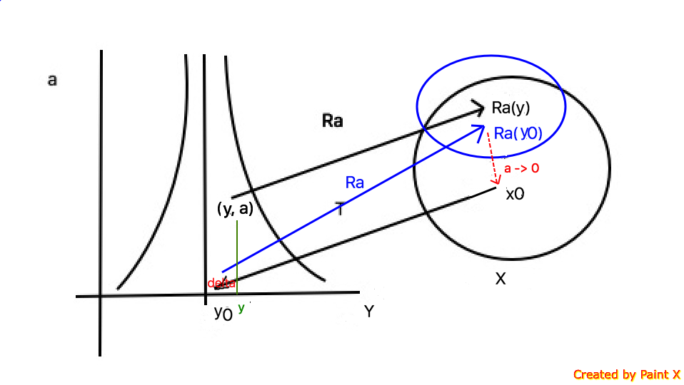
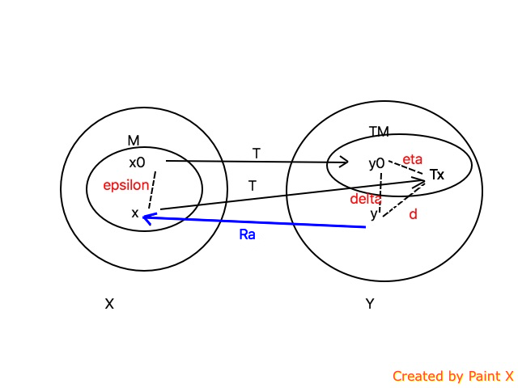

# Inverse Problem

## well-posedness (Hadamard, 1923)
Suppose $T:X\to Y$, $Tx=y$.
C1: $\forall y\in Y, \exists x\in X, Tx=y$;
C2: $y_1=y_2\iff x_1=x_2$;
C3: $\forall \epsilon>0 cls(y_1,y_2), (z_1,z_2)<\epsilon$.

## Quasi-solution （V.K. Ivanov）
$x_0$ is qs to $Tx=y$ in $M\subset X$, if
$$d(Tx_0, y)=\min_{x\in M} d(Tx, y), y\in Y, T:X\to Y.$$

### Theorem 1
qs to $Tx=y$ in compact subset $M$ $E!$, proj of $y$ on $TM$ is unique, then qs is unique continuously depanding on $y$. ($T^{-1}:TM\to X$ is continuous.)

### Theorem 2
For lin eq $Tx=y, T$ is $1-1$, $M$ is convex, $Y$ is strict convex, then ...

### Tikhonov Regularization (1963)
 $\{R_\alpha:A\subset Y\to X\}$ is $y_0$-regular if 

 * $\exists\delta_1>0, R_\alpha(y)$ defined on $d(y,y_0)<\delta<\delta_1$;
 * $\forall \epsilon>0loc(x_0)x\in X, d(R_{\alpha(\delta)}y, x_0)<\epsilon$;

 where $Tx_0=y_0$.

### Another Def

  $\{R_\alpha:A\subset Y\to X\}$ is (locally) $y_0$-regular if 

 * $R_\alpha(\cdot)$ defined on ($y_0$ locally);
 * $\forall \epsilon>0loc(y_0)y\in Y, d(R_{\alpha'}y, x_0)<\epsilon$.

*Remark.* Generally $\forall U\in \mathcal{T}_{x_0}loc(y_0)y\in X (sml \alpha) , R_{\alpha}y \in U$.

### Lemma
$T:X\to Y, R_\alpha:Y\to X$ is continous. If
$$\lim_{\alpha\to0}R_\alpha Tx=x,\forall x\in X,$$
then $R_\alpha$ is regular.

*Proof.* $d(R_\alpha y, x_0) < d(R_\alpha y_0, R_\alpha y) + d(R_\alpha y_0, x_0)$.

### Theorem 1(construction of $R_\alpha$)
Suppose $T:X\to Y$.
$\forall \alpha>0,y\in Y\exists z_\alpha\in F$ (dense in $X$), 
$M_\alpha(z_\alpha,y)=\inf_{z\in F}M^\alpha(z,y)$ ($S^\alpha=\{z_\alpha\}$).

$$M_\alpha(z,y):=d^2(Tz,y)+\alpha \Omega(z), z\in F, (\text{smoothing function})$$
where $\Omega\geq0\in C(F)$ (stable function) and $F\{\Omega(z)\leq d>0\}$ is compact in $F$.

*Proof.* There exists $\{z_n^\alpha\to z_\alpha\in F\}, M_\alpha(z_n^\alpha, y)\searrow M_\alpha(z_\alpha, y)$ (essentially).

*Remark.* $z_\alpha$ is unique if $\Omega$ is quad and $T$ is linear. Define uniquely
 $$R_\alpha(y)=z_\alpha:Y\to F.$$

### Theorem 2(depends on Theorem 1)
$Ty_0=x_0$, $\forall \epsilon>0,\beta_1(\alpha),\beta_2(\alpha)\in C[0,0+]\geq0\nearrow$, ($\frac{\delta^2}{\beta_1(\delta)}\leq\beta_2(\delta),\beta_2(0)=0$.) then $loc(y_0) y\exists \alpha$,

$$d(z_\alpha,x_0)<\epsilon, z_\alpha=R_\alpha(y),$$
where $R_\alpha$ is regular.

*Proof.* $M:=\{z\in F| \Omega(z)\leq \beta_1(\alpha)+\Omega(x_0)\}$, $T:M\leftrightarrow T[M]$, $\rho(Tz_\alpha, y_\alpha)\leq\sqrt{\delta^2+\beta_2(\delta)\Omega(x_0)}$ (inv-ineq). $d(y, y_0)\leq d(y, Tx)+d(Tx, y_0), x=R_\alpha y$.

## Posterior Strategy
### Lemma 1
$m(\alpha):=M(z_\alpha,y), \phi(\alpha):=d^2(Tz_\alpha)\nearrow,\psi(\alpha):=\Omega(z_\alpha)\searrow$.

### Lemma 2
If $\alpha_n\to \alpha>0$ and $z_{\alpha_n}\in S^{\alpha_n}$ conv., then $z_{\alpha_n}\to z_\alpha\in S^\alpha$.

*Proof.*$M^{\alpha_n}(z_{\alpha_n},y)\to M^{\alpha_0}(z,y)\leq M^{\alpha_n}(z_{\alpha_0},y)\to M^{\alpha_0}(z_{\alpha_0},y)$.

### Lemma 3
$\phi(\alpha):lsc,\psi(\alpha):rsc$. If $\phi,\psi$ has single value, they are cont.

### Lemma 4
$TX$ is dense, $m(0)=0$, then $m(\alpha)\to0$, $\lim_\alpha\phi(\alpha)=\phi(0)=0$. 

### Morozov discrepancy principle(1966)
If $\phi(\alpha)$ has single value, then when $d(Tx_0,y)>\delta,\exists\alpha$, 

$$
d(Tz_\alpha,y)=\delta ~~~~~~~~~~~~~~~~~~~~~~~~ (\textbf{Morozov eq.})
$$

 where $\Omega(x_0)=\inf_{x\in F}\Omega(x)$. $R_\alpha$ is regular, $\alpha(\delta)$ is the solution of the eq..

## In Hilbert spaces

### Theorem

$T:X\to Y$, $\exists!z_\alpha\in X, M^\alpha(z_\alpha,y)=\inf M^\alpha$, $z_\alpha$ is the unique solution to

$$
\alpha z_\alpha+T^*Tz_\alpha=T^*y. ~~~~~~~~~~~~~~~~~ \textbf {Euler eq.}
$$

and $y\mapsto z_\alpha$ is cont.

